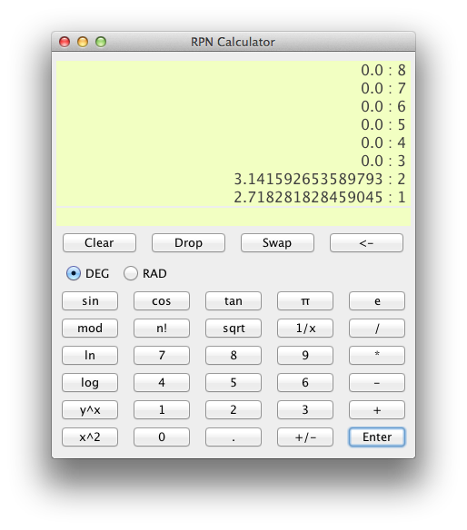

Swing-RPN-Calculator
====================
A simple Java Swing RPN Calculator I made just because.

RPN
===
This calculator is a [Reverse Polish Notation](https://en.wikipedia.org/wiki/Reverse_Polish_notation) calculator not to be mistaken with a traditional calculator.

Develop
=======
Clone this repo through [IntelliJ IDEA](http://www.jetbrains.com/idea) ought to do it. After cloning, setup SDK.

About
=====
This project is just a small 'fooling around with Java and swing' project. Nothing too serious. My secondary objective with this project was to get familiar with the [IntelliJ IDEA](http://www.jetbrains.com/idea).

